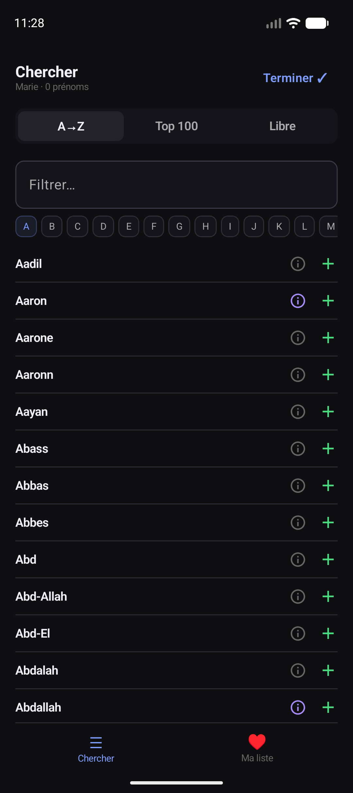
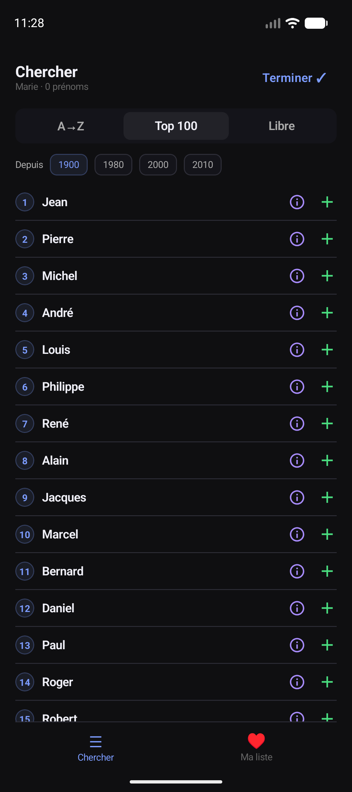
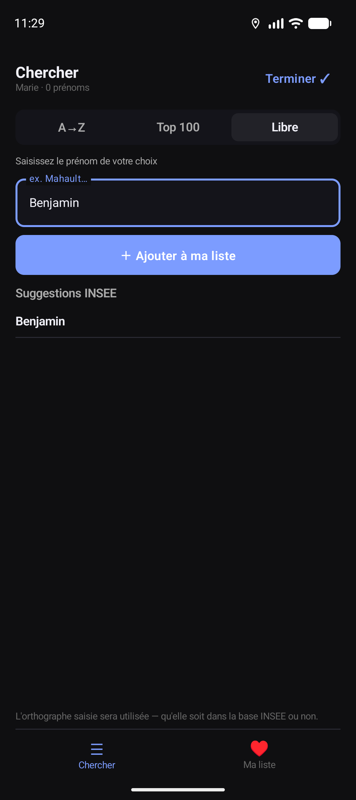
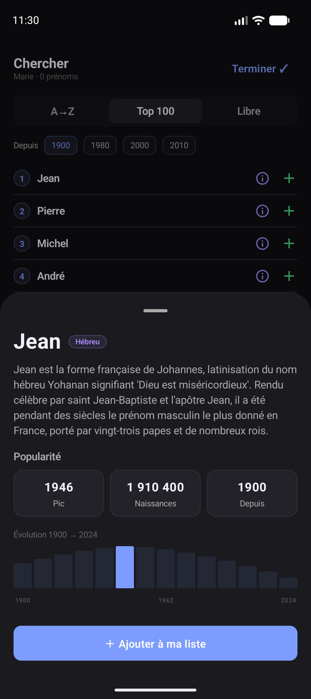
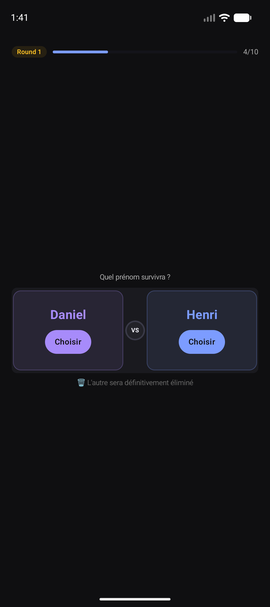
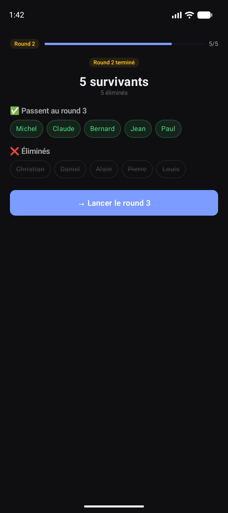
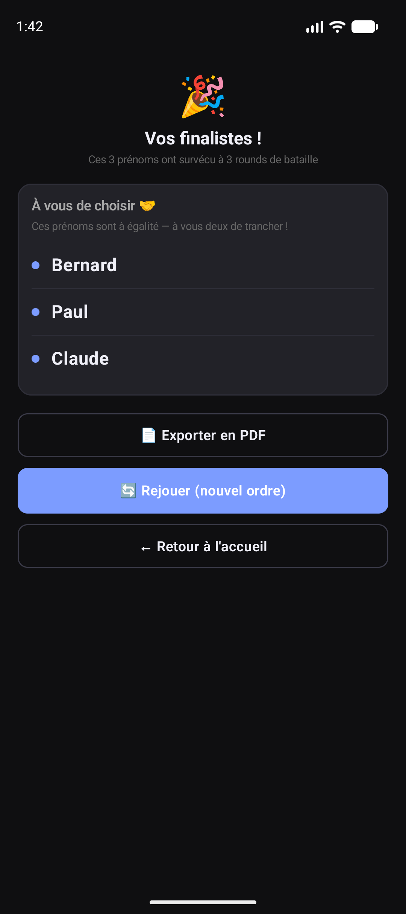
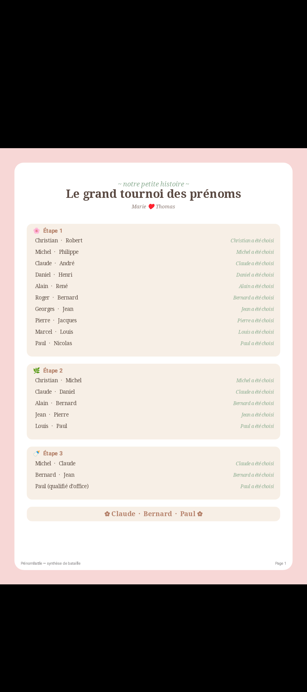

# PrénomBattle

[](LICENSE)

A collaborative Android app for expecting parents to settle the eternal debate: which baby name wins? Each parent builds their shortlist, then names fight head-to-head in a tournament-style battle until only the finalists remain.

---

## Screenshots

### Browse & Search Names

| A → Z | Top 100 | Free entry |
|-------|---------|------------|
|  |  |  |

### Name Details



Tap the info icon on any name to see its etymology, linguistic origin, popularity peak year, total births recorded, and a historical birth chart.

### The Battle

| Duel | Round summary | Finalists |
|------|---------------|-----------|
|  |  |  |

### PDF Export



At the end of a session the full battle history — every duel, every elimination, and the final winners — can be exported as a PDF.

---

## How it works

1. **Setup** — Each parent enters their first name so the app can track whose turn it is.
2. **Shortlist** — Each parent searches the French INSEE name database and adds the names they like to their personal shortlist. Names can be picked from the full A→Z catalogue, filtered by the Top 100 most popular names (by decade), or typed in directly.
3. **Battle** — The app merges both shortlists and runs an elimination tournament. Each round pairs names in one-on-one duels; the chosen name survives, the other is permanently eliminated. Names with no opponent in a round auto-qualify.
4. **Results** — When the tournament ends, the remaining names are presented as finalists. If there is a tie, both parents decide together. The complete battle report can be exported as a PDF keepsake.

---

## Architecture

The project follows **Clean Architecture** with an **MVVM** presentation layer.

```
app/src/main/kotlin/com/telen/namebattle/
├── data/
│   ├── local/          # Room database, DAOs, entities, DataStore
│   ├── mapper/         # Entity ↔ domain model mappers
│   └── repository/     # Repository implementations
├── di/                 # Koin modules (Database, Repository, UseCase, ViewModel, Export)
├── domain/
│   ├── model/          # Pure Kotlin domain models (FirstName, Session, BattleState…)
│   ├── repository/     # Repository interfaces
│   └── usecase/        # One class per use case, grouped by feature
│       ├── auth/
│       ├── battle/
│       ├── export/
│       ├── firstname/
│       └── session/
├── export/             # PDF generation (android.graphics, no business logic)
├── presentation/
│   ├── auth/           # Parent name entry
│   ├── battle/         # Duel screen + round summary
│   ├── components/     # Shared stateless composables
│   ├── home/           # Session list
│   ├── launch/         # Splash / session resume
│   ├── navigation/     # NavGraph + Screen sealed class
│   ├── results/        # Finalists + export actions
│   ├── search/         # Name browser + shortlist management
│   ├── setup/          # Battle configuration
│   └── theme/          # Colors, typography, NbTheme
└── util/               # Timber Crashlytics tree, extensions
```

### Key decisions

| Concern | Choice |
|---------|--------|
| UI | Jetpack Compose — no XML layouts |
| State | `StateFlow` + `collectAsStateWithLifecycle` |
| DI | Koin |
| Local DB | Room + KSP |
| Networking | Ktor (name meanings fetched from remote) |
| Navigation | Navigation Compose (type-safe routes) |
| Async | Coroutines + Flow — no LiveData, no RxJava |
| Logging | Timber → Firebase Crashlytics in release |
| Testing | JUnit + MockK + `kotlinx-coroutines-test` |

---

## Tech stack

- **Language** — Kotlin only
- **Min SDK** — 23 (Android 6.0)
- **Target SDK** — 37
- **Kotlin / Gradle** — latest stable at time of development
- **JVM** — Java 17

---

## Build

### Debug

No setup required. A development keystore is generated automatically on the first build.

```bash
./gradlew assembleDebug
```

### Release

Requires three environment variables pointing to the release keystore:

```bash
export KEYSTORE_PASSWORD=...
export KEY_ALIAS=...
export KEY_PASSWORD=...

./gradlew assembleRelease
```

### Tests

```bash
# Unit tests
./gradlew test

# Unit tests + JaCoCo HTML coverage report (build/reports/jacoco/html)
./gradlew jacocoUnitTestReport
```

Coverage excludes Compose UI layers (screens, previews, components, theme, navigation) and Android infrastructure that requires a runtime (DAOs, Room, DataStore, PDF rendering). Only domain use cases and repository implementations are measured.
